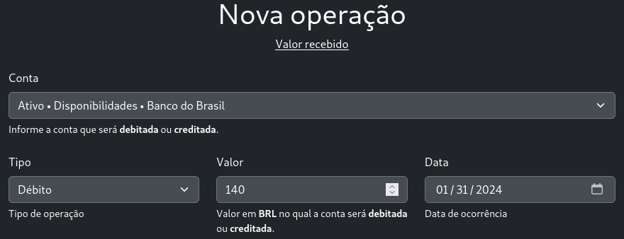

# EquiBook

## Descrição

Este é um projeto de estudo para fixar conceitos aprendidos sobre contabilidade introdutória. EquiBook refere-se a junção das palavras Livro e Equilíbrio. O livro consiste em uma série de transações realizadas ao longo de determinado período e que sempre se mantém em equilíbrio a partir de lançamentos a crédito/débito.

## Funcionalidades

### Gerenciamento de Contas

As contas "raízes" são aquelas que passam a existir no momento de registro do usuário. Elas são as contas patrimoniais (Ativo, Passivo e Patrimônio Líquido) e de resultado (Receita e Despesa).

A partir das contas raízes é possível a criação de contas de desdobramento, possibilitando, dessa forma, estabelecer relações hierárquicas entre as contas.

De modo bastante simplista, a hierarquia de contas é bastante semelhante a um sistema de arquivos, onde a conta raiz representa o diretório raiz "/" e partir desse diretório é possível criar subdiretórios (desdobramentos).

Exemplo 1:

    Ativo (/)
        Disponibilidades (/Disponibilidades)
            Banco do Brasil (/Disponibilidades/Banco do Brasil)
            Nubank (/Disponibilidades/Nubank)

Exemplo 2:

    Receitas (/)
        Lucros com ações (/Lucros com ações)
            LWSA3   (/Lucros com ações/LWSA3)
            ...
        Proventos (/Proventos)
        Estágio (/Estágio)

    Despesas (/)
        Despesas de alimentação (/Despesas de alimentação)
        Despesas de Corretagem (/Despesas de Corretagem)

### Iniciação de período contábil.

Permite o usuário iniciar seu primeiro período contábil. Para isso, ele deverá informar a data em que o período inicia e finaliza. Após o usuário ter realizado a iniciação do período contábil a funcionalidade para criação de transações se torna disponível.

Por exemplo, o usuário pode iniciar um período contábil em 01/01/2024 e finalizar em 31/12/2024.

### Cadastro de transações

Uma transação representa um evento contábil a ser registrado. "Empréstimo ao Sr. Y" ou "Pagamento de dívida Z". O seu cadastro necessita apenas do título e descrição que representa a transação.

O cadastro de transações funciona de modo similar a uma lista encadeada, onde cada nova transação é inserida no final da lista. Embora não exista uma funcionalidade para inserir transações no meio da lista é possível fazer isso  através das funcionalidades de "Mover para Cima" e "Mover para Baixo". Isso permite alterar a ordem de uma transação em relação às outras.

### Lançamentos (Débito & Crédito)

Após a criação da transação os lançamentos podem ser realizados. Os lançamentos (referidos na aplicação como operações de débito e crédito) permitem representar o fluxo de dinheiro em relação às contas patrimoniais e de resultado.

Exemplo: Sua Tia pediu para fazer o pagamento da conta de Luz e falou que iria devolver o dinheiro no final do mês. O valor a ser pago é de 140 R$. Considere que você já tem inicialmente 420 R$ em sua conta no banco.

Temos duas transações associadas a esse exemplo. O primeiro é quando o papel de luz é pago. O segundo é quando o dinheiro é devolvido.

Cada conta raiz tem um determinado tipo de saldo. Os desdobramentos dessas contas herdam seu tipo de saldo.

Então por exemplo:
**Ativo** e **Despesas** têm saldo devedor, enquanto **Passivo**, **Patrimônio Líquido** e **Receitas** têm saldo credor.

Seguindo o raciocínio anterior, se existe um desdobramento de Despesa chamado **Gasto de Alimentação** então ele terá o mesmo tipo de saldo que a conta de Despesa (Devedor).

Contas que possuem saldo devedor aumentam quando realizamos lançamentos a débito e diminuem quando realizamos lançamentos a crédito.

Temos a situação oposta para contas de saldo credor.

As Contas que possuem saldo credor aumentam quando realizamos lançamentos a crédito e diminuem quando realizamos lançamentos a débito.

Com isso em mente e representando a estrutura de contas da seguinte maneira:

    Ativo:

        Disponibilidades:
            Banco do Brasil

        Valores a receber:
            Tia X

Vamos representar os lançamentos anteriores

Transação 1: Pagamento da conta de Luz
Nessa situação o dinheiro vai "sair" da conta "Banco do Brasil" e "entrar" na conta "Tia X".

Em termos de débito e crédito representamos da seguinte forma:

A conta "Banco do Brasil" diminui a crédito, logo:

> Credita-se a conta "Banco do Brasil" em 140 R$

A conta "Tia X" aumenta a débito, logo:

> Debita-se a conta "Tia X" em 140 R$

> O saldo da conta "Banco do Brasil" é 420 - 140, que é 280 R$.

> O Saldo da conta Tia X é 0 + 140, que é 140 R$.

Transação 2: No final do mês os 140 R$ são devolvidos.

Agora o oposto ao que ocorreu na transação aconteceu. O dinheiro "sai" da conta "Tia X" e entra na conta "Banco do Brasil".

A conta "Banco do Brasil" aumenta a débito, logo:

> Debita-se a conta "Banco do Brasil" em 140

A conta "Tia X" diminui a crédito, logo:

> Credita-se "Tia X" em 140

> O saldo da conta "Banco do Brasil" é 280 + 140, que é 420 R$.

> O saldo da conta Tia X é 140 - 140, que é 0 R$.

### Encerramento de contas

O encerramento de contas é um procedimento que sempre antecede o encerramento do período contábil atual e consiste na realização de duas tarefas.

1: Zerar todas as contas de resultado (receitas e despesas), transferindo seus saldos para uma conta de uso interna do sistema chamada de Resultado. Ao realizar este procedimento o sistema gera automaticamente uma transação contendo todas as transferências de saldos que ocorreram.

2: Após o encerramento das contas e receitas e despesas a distribuição de possíveis lucros ou prejuízos são feitas em contas do Patrimônio Líquido.

A distribuição de lucros ou prejuízos é feita de acordo com as regras de contabilidade. Quando a quantidade de receitas supera as despesas, o lucro é creditado na conta de lucros. Quando há prejuízo, o prejuízo é debitado na conta de Prejuízos.

### Encerramento do período contábil.

O encerramento de contas sucede o item anterior. Ele é realizado no momento que o usuário sinaliza que todas as pendências e ajustes do período anterior foram realizadas e então o período atual é posto no estado "FECHADO" e um novo período é iniciado.

## Pré-requisitos

A utilização do projeto pode ser feita executando a aplicação diretamente ou através de containers.

Em ambos os casos é necessário ter o python instalado em sua máquina. A versão do python utilizada no projeto é a 3.10. Más caso esse valor seja alterado no futuro você pode conferir essa informação no arquivo **pyproject.toml**. Caso não tenha essa versão do python, considere o uso de ferramentas como o pyenv para gerenciar diferentes versões do python no seu sistema operacional.

Também é recomendado, mas não obrigatório, o utilitário make.

## Instalação

**1. Faça o clone deste repositório**

    git clone https://github.com/pedro-belo/sistema-contabil.git

**2**. Após o download e descompactação vá para a raiz do projeto. (onde existe um arquivo chamado manage.py)

    cd sistema-contabil

**3. Inicie um ambiente de virtual usando python ou poetry**

    python -m venv .venv

ou 

    poetry shell

**3. Instalação de dependências do python**

    pip install -r requirements.txt

ou

    poetry install

**4. Instalação de dependências para utilização dos arquivos estáticos**

    # Considerando que você está na raiz do projeto
    cd equibook/core/static/
    npm install

**5. Volte para o diretório raiz do projeto**

    # Considerando que você está em equibook/core/static/
    cd ../../../

**6. Configurações de variáveis de ambiente**

    mv .default.env .env -i

**6. Aplicação de migrações**

    python manage.py migrate

## Execução

**1. Inicie o servidor**

    python manage.py runserver

**2. Acesse o endereço da sua interface de loopback**

    http://127.0.0.1:8000

ou    
    
    http://localhost:8000

## Uso

O uso será demonstrado através do exemplo a seguir, retirado do livro "Contabilidade Introdutória - Livro de Exercícios (Sérgio de Iudícibus e Eliseu Martins)"

**EXERCÍCIO 3.1**
A seguir estão relacionadas as operações realizadas pela sociedade de prestação de serviços Remendão S.A., em
janeiro/X2 (em $):

 **1** investimento inicial de capital no valor total de $ 10.000 em dinheiro;
 
 **2** compra à vista de móveis e utensílios, na importância de $ 2.000;
 
 **3** compra de peças para reparos, nas seguintes condições: $ 500 à vista e $ 1.000 a prazo;
 
 **4** venda a prazo de $ 500 de peças para reparos, pelo preço de custo;
 
 **5** compra de um veículo, a prazo, por $ 600, mediante a emissão de uma nota promissória;
 
 **6** pagamento de 50% da dívida relativa à compra de peças para reparos;
 
 **7** investimento adicional dos sócios, aumentando o capital em mais $ 5.000, sendo $ 2.500 em dinheiro e $
2.500 em peças para reparos;
 
 **8** venda à vista de $ 200 em peças para reparos, pelo preço de custo;
 
 **9** recebimento do valor da venda a prazo referente ao item 4;
 
 **10**. obtenção de um empréstimo, depositado pelo banco na conta-corrente da empresa, no último dia do mês de
janeiro/X2, no valor de $ 5.000, mediante a emissão de uma nota promissória;

Resolução em:
[Exemplo de Uso](https://github.com/pedro-belo/sistema-contabil/tree/main/example)